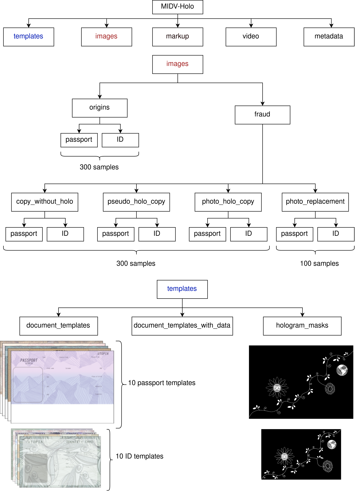
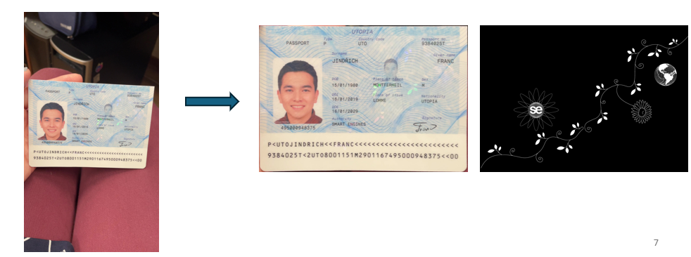

# Détection d’hologrammes à partir de vidéos

## Objective
This project aims to be able to detect the presence of a hologram on a passport and determine whether the document is original or fraudulent. To conduct this study, we used the MIDV-Holo dataset, which contains passport videos recorded using smartphones. 

Example of a hologram in a French passport

## Method : Random walks approach

From a video frame, we try to create a random path of pixels (information spatial). Over time, we have different frames of the passport, we will take the information of these pixels and combine them to create a 2D Spatio-Temporal Representation.

A hologram pixel is characterized by high saturation, which fluctuates over time. If an STR image of a region contains a hologram, there will be color variation between pixels over time. In contrast, a non-hologram STR will have no or tiny fluctuations over time.

After getting the STRs images, we pass this dataset to a CNN model for classification.

To classify a video, we will generate 1000 STRs randomly and use the trained model to classify these STRs. If the ratio of the number STRs predicted as "origins" over 1000 is bigger than a threshold determined, this video is categorized as "origin".
## Dataset

The dataset used to create the STRs (Spatio-Temporal Representation) for training is MIDV-Holo - [Link of dataset](https://github.com/SmartEngines/midv-holo)

The structure of dataset : 

The dataset has:

- 150 videos of "origin" documents (with hologram).

- 150 videos of "fraud" documents. (50 copies of a document without hologram, 50 copies of a document with drawn in an image editor hologram pattern, and 50 printed photos of “original” document).

## Instruction

To re-do this project, here are some steps to take with the code:

### Step 1: Split the MIDV-HOLO dataset into train, validation and test set.

The script *split_folders.py* is used to split initial dataset into train(64%), validation(16%) and test(20%) set. The distribution of videos for the construction of the dataset was done by copying the one produced in [this paper](https://arxiv.org/pdf/2404.17253). The script will create a folder containing 3 files; each has a list of videos for training, val, or testing.

The structure of folder after spliting dataset : 

  

### Step 2 : Extract the passport image from the frame of video.

We need to work with the passport image and ignore the video's background. The script *extract_passport.py* gets the coordinates of the corner of the passport in the video from folder markup and then creates images of the passport with the same size as the hologram mask and saves them in extracted_passport folder. 

I used cv2.findHomography and cv2.warpPerspective to extract the passport image.

  

### Step 3 : Generate STRs for training.

The script *generate_str.py* will create STRs for training and save the coordinates of the random path of pixels of each STR for later visualization. In this script, we must define the folder for saving the images, the type folder that is used to create STRs (origins or fraud), the number of STRs that we want to create in each video, ...

  

### Step 4 : Train model CNN

I used pre-trained model and fine-tune with the STR dataset. The model was trained using Google Colab. The notebook *Holograme_Classification.ipynb* was used to train mobilenetv2 model and *ViT_Classification.ipynb* was used to train vit_base_patch16_224 model.

  

## Bibliography

LI Koliaskina et al. “MIDV-Holo : A Dataset for ID Document Hologram Detection in a Video Stream”. In : International Conference on Document Analysis and Recognition. Springer. 2023, p. 486-503. doi : https://doi.org/10.1007/978-3-031-41682-8_30.

Harshal Chaudhari, Rishikesh Kulkarni et M.K. Bhuyan. “Weakly Supervised Learning based Reconstruction of Planktons in Digital In-line Holography”. In : Digital Holography and 3-D Imaging 2022. Optica Publishing Group, 2022, W5A.6. doi : 10.1364/DH.2022.W5A.6. url : https://opg.optica.org/abstract.cfm?URI=DH-2022-W5A.6.